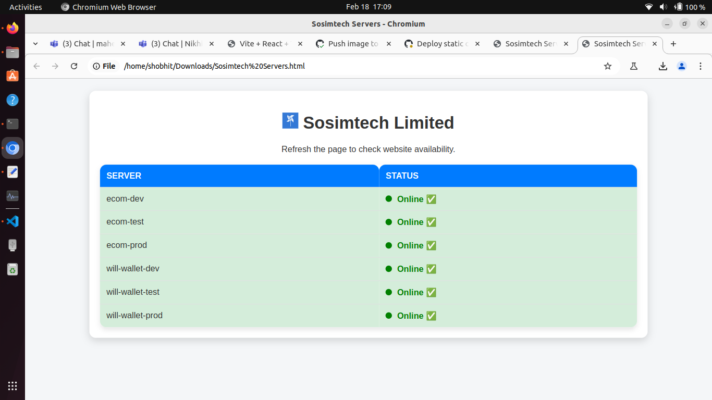

# How to save status page

1. **Open  status page deployed site in new tab**  - [Status Page Link](https://shobhitpatkar.github.io/status-page-servers)

2. **Save the web page with `Ctrl + S`**, name it as **"Sosimtech Servers.html"** and then press enter.  
   

3. **Click on any server name** (so that you can go to the server details page). Again, press `Ctrl + S` and save it with the name **"details.html"** and then press enter.  
   

4. **Go to your Downloads folder** or the location where you saved the webpage. Right-click your webpage (may be named as **Sosimtech Servers.html**) and open it with **Google Chrome**.  
   

5. Once your page is opened, **make a hard refresh** with `Ctrl + R`.  
   

6. Now your **status page is ready**. Click on any server to see updates for the last 24 hours.
   